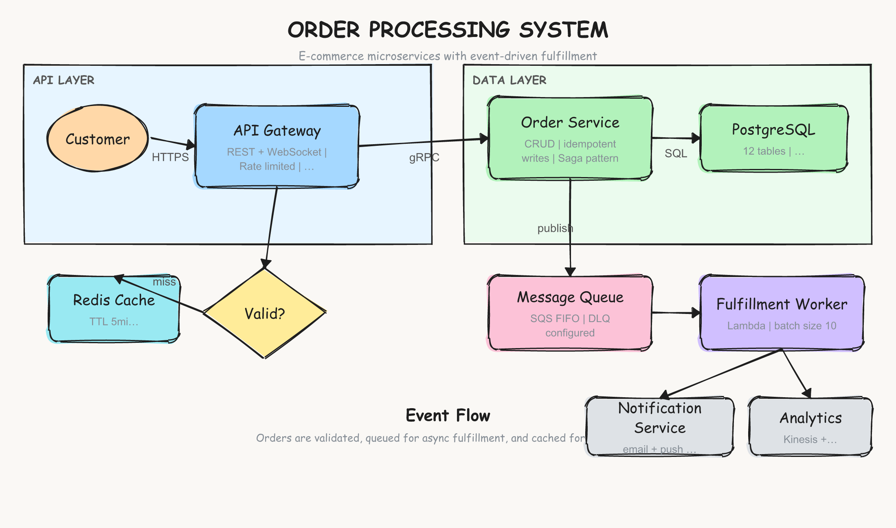

# Excalidraw Skill for Claude Code

A Claude Code skill that transforms any text prompt into a hand-drawn Excalidraw-style diagram, saved as SVG + PNG locally. No browser, no Puppeteer, no MCP server.



## What it does

Describe a diagram in plain English and get a hand-drawn sketch rendered locally in under a second:

- **Flowcharts** — decision trees, process flows, user journeys
- **Architecture diagrams** — services, databases, APIs, connections
- **System designs** — components, data flows, deployment pipelines

Output uses the authentic Excalidraw look: Virgil handwritten font for labels, Cascadia monospace for annotations, and roughjs for sketchy hand-drawn shapes.

## Install

```bash
# Clone into your Claude Code skills directory
git clone https://github.com/aref-vc/excalidraw-skill.git ~/.claude/skills/excalidraw

# Install renderer dependencies
cd ~/.claude/skills/excalidraw/scripts && npm install
```

## Usage

Once installed, trigger the skill in Claude Code:

```
/excalidraw user -> API gateway -> auth service -> database
```

Or describe what you want naturally:

```
draw me a hand-drawn architecture diagram with a load balancer,
three API servers, a Redis cache, and a PostgreSQL database
```

## Output

By default, diagrams are saved to `~/Downloads/Excalidraw/` as both SVG and PNG (2x resolution).

To change the output directory, edit the `OUTPUT_DIR` line in `SKILL.md`:

```
OUTPUT_DIR: ~/Documents/My Diagrams/
```

## Supported Elements

| Type | Description | Key properties |
|------|-------------|----------------|
| `rectangle` | Services, components (optional rounded corners) | `label`, `annotation`, `sectionLabel`, `rounded` |
| `ellipse` | Actors, users, external systems | `label`, `annotation` |
| `diamond` | Decisions, conditions | `label` |
| `arrow` | Connections between shapes (auto-routed) | `label` (collision-aware positioning) |
| `line` | Dividers, separators | `points` |
| `text` | Titles, annotations, labels | `subtitle` (stacked below with gap) |

## Features

### Inline annotations

Add technical details directly on shapes with the `annotation` property. Annotations render in monospace below the label and auto-truncate with ellipsis if they exceed the shape bounds.

```json
{
  "type": "rectangle",
  "label": "API Gateway",
  "annotation": "REST + WebSocket | Rate limited | JWT auth",
  "width": 200, "height": 100
}
```

### Section labels

Group related shapes in zone rectangles with `sectionLabel`. The label renders bold at the top-left corner, inset from the edge.

```json
{
  "type": "rectangle",
  "x": 30, "y": 80,
  "width": 500, "height": 220,
  "fill": "#e7f5ff",
  "sectionLabel": "API LAYER"
}
```

### Title with subtitle

Add descriptive text below titles using the `subtitle` property. The subtitle renders in a smaller, gray font with proper spacing — no overlap.

```json
{
  "type": "text",
  "x": 450, "y": 35,
  "text": "SYSTEM ARCHITECTURE",
  "fontSize": 26,
  "subtitle": "Cloud deployment with microservices"
}
```

### Collision-aware arrow labels

Arrow labels automatically shift perpendicular to the arrow path to avoid overlapping with shapes. The renderer tries multiple positions and picks the first collision-free one.

### Width-aware text wrapping

All text wraps based on actual pixel width (estimated from font metrics), not a fixed character count. Labels stay within shape bounds, and long words are handled gracefully.

## Color Palette

| Color | Hex | Typical use |
|-------|-----|-------------|
| Blue | `#a5d8ff` | APIs, services |
| Green | `#b2f2bb` | Databases, storage |
| Orange | `#ffd8a8` | Users, actors |
| Yellow | `#ffec99` | Decisions, warnings |
| Pink | `#fcc2d7` | Events, messages |
| Purple | `#d0bfff` | Auth, security |
| Gray | `#dee2e6` | Infrastructure |
| Cyan | `#99e9f2` | Caching, network |

**Zone backgrounds** (faint, for grouping): `#e7f5ff` (blue), `#ebfbee` (green), `#f1f3f5` (gray), `#fff9db` (yellow), `#fff0f6` (pink), `#f3f0ff` (purple)

## How it works

1. Claude reads your prompt and generates a JSON diagram spec
2. The JSON is passed to `render.mjs` — a Node.js script (~350 lines)
3. **roughjs** draws hand-drawn shapes onto an SVG (via xmldom, no browser needed)
4. Text is wrapped using width-aware measurement (estimated char widths per font)
5. Arrow labels are positioned with collision avoidance against all shapes
6. **resvg-js** converts the SVG to a 2x PNG with embedded fonts
7. Both files are saved to your output directory

Total render time: ~200-400ms.

## Fonts

Bundled fonts (both open source):
- **Virgil** (OFL-1.1) — Excalidraw's handwritten font, used for shape labels and titles
- **Cascadia** (MIT) — Microsoft's monospace font, used for annotations and arrow labels

## Dependencies

| Package | Purpose | License |
|---------|---------|---------|
| `roughjs` | Hand-drawn shape rendering | MIT |
| `@xmldom/xmldom` | Server-side SVG DOM | MIT |
| `@resvg/resvg-js` | SVG to PNG conversion | MPL-2.0 |

## Requirements

- [Claude Code](https://docs.anthropic.com/en/docs/claude-code) CLI
- Node.js 18+

## Changelog

### v2.0.0 (2026-02-17)

Major renderer rewrite focused on text layout and collision avoidance.

**New features:**
- `annotation` property on shapes — mono text below label, auto-truncated to fit
- `sectionLabel` property on rectangles — bold top-left inset label for zones
- `subtitle` property on text elements — stacked below title with proper gap
- Arrow labels with collision avoidance — tries 4 perpendicular offsets
- Width-aware text wrapping — pixel-based wrapping using font metrics

**Fixes:**
- Title and subtitle text no longer overlap
- Annotations stay within shape boundaries (truncated with ellipsis when needed)
- Arrow labels no longer render inside shapes
- Zone/section labels no longer collide with zone borders
- Minimum 13px font size enforced for all annotations
- Text wrapping uses estimated pixel widths instead of fixed 22-char limit

### v1.0.0 (2026-02-16)

Initial release. Basic shapes, arrows, text, and roughjs rendering.

## License

MIT
